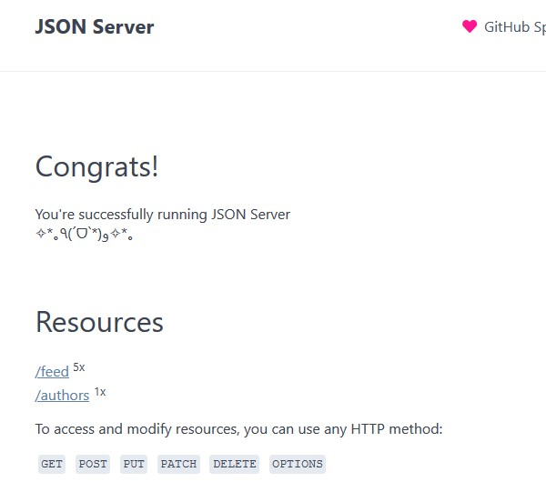
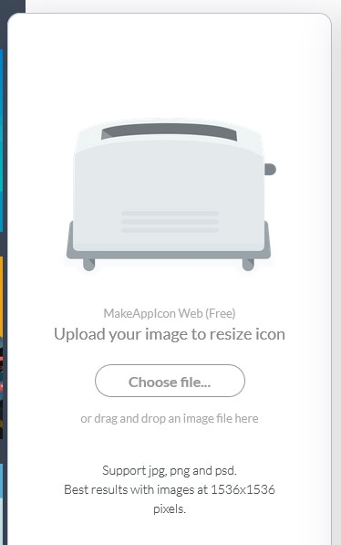

# Aula 4

Essa é a nossa última aula,
iremos rever um pouco do que passamos nos exercícios anteriores.

## CheckList de hoje

### Aplicativo Fake Instagram

- Listar fotos

- Adicionar novas fotos

- Alterar ícones do aplicativo

---

Podemos iniciar o novo projeto utilizando a base do app anterior (star wars app) ou
iniciar um novo projeto através do template com o comando:
<https://github.com/juninmd/react-native-template-unifacef>

```shell
npx react-native init Instagram --template react-native-template-unifacef
```

Feito isso, podemos preparar o ambiente da nossa API FAKE com mock

Adicione ao seu projeto

```shell
yarn add json-server -D
```

Vamos adicionar um novo arquivo chamado `server.json` com o resultado:

```json
{
  "feed": [
    {
      "id": 1,
      "image": "https://i.pinimg.com/originals/26/ea/fc/26eafc0b14488fea03fa8fa9751203ff.jpg",
      "description": "Are you working for your dreams?",
      "authorId": 1
    }
  ],
  "authors": [
    {
      "id": 1,
      "name": "jr_acn",
      "avatar": "https://avatars0.githubusercontent.com/u/6952134?s=50"
    }
  ]
}
```

Vamos aproveitar e incrementar com mais algumas imagens para dar uma sensação melhor,
após preencher esse arquivo, vamos validar a nossa api utilizando o seguinte comando:

```shell
yarn json-server server.json -d 1000 -w
```




Após o comando iniciar, acesse a url:

```url
http://localhost:3000/feed?_expand=author
```

Veja que através da query param ele já consegue realizar joins.

---

Agora voltamos ao aplicativo

> src/routes/index.tsx

Verificamos se a rota inicial está assim:

```tsx
function Routes() {
  return (
    <NavigationContainer>
      <StatusBar backgroundColor="black" barStyle="dark-content" />
      <Stack.Navigator initialRouteName={ROUTES_NAMES.Home}>
        <Stack.Screen options={{
          headerTitleAlign: 'center',
          headerTitle: 'Unifacef Gram',
          headerTintColor: 'white',
          headerStyle: {
            backgroundColor: 'black',
          }
        }} name={ROUTES_NAMES.Home} component={Home} />
      </Stack.Navigator>
    </NavigationContainer>
  );
}
```

---

Acesse o arquivo
> src/stores/home.store.tsx

Adicione o tipo

```tsx
type Post = {
  id: number;
  image: string;
  description: string;
  authorId: number;
  author: {
    id: number,
    name: string,
    avatar: string
  }
}
```

Adicione o import

```tsx
import axios from 'axios';
```

Adicione a observable com a tipagem

```tsx
@observable posts: Post[] = [];
```

Implemente a action

```tsx
  @action getPosts = async () => {
    try {
      const { data: posts } = await axios.get<[Post]>('http://localhost:3000/feed?_expand=author');
      this.posts = posts;
    } catch (error) {
      console.log(error);
      this.posts = [];
    }
  }
```

Agora acesse o arquivo

> src/containers/home/index.tsx

Implemente dentro da classe

```tsx
  async componentDidMount() {
    const { getPosts } = this.props.homeStore;
    await getPosts();
  }
```

Dentro de `render` adicione

```tsx
const { posts } = this.props.homeStore;
```

Agora dentro de ScrollView implemente os posts

```tsx
posts.map((post, index) => (
    <Card key={index}>
        <View>
        <Avatar
            size={'small'}
            source={{ uri: post.author.avatar }}/>
        <Text>{post.author.name}</Text>
        </View>
        <Image source={{ uri: post.image }} />
        <Divider />
        <View>
        <Text>{post.description}</Text>
        </View>
    </Card>))
```

Adicione os estilos

```tsx
const styles = StyleSheet.create({
  card: { padding: 1, margin: 4, backgroundColor: 'black' },
  header: {
    padding: 3,
    alignItems: 'center',
    flexDirection: 'row'
  },
  scrollView: {
    backgroundColor: 'black',
    color: 'white',
    marginHorizontal: 20,
  },
  avatar: { marginRight: 5 },
  picture: { width: 'auto', minHeight: 200, maxHeight: 500 },
  footer: {
    margin: 4,
    padding: 4,
    alignItems: 'center',
    flexDirection: 'row'
  },
  title: {
    fontSize: 15,
  },
});
```

Agora você poderá estilizar os componentes

```tsx
posts.map((post, index) => (
    <Card key={index} style={styles.card}>
        <View style={styles.header}>
        <Avatar
            size={'small'}
            source={{ uri: post.author.avatar }}
            style={styles.avatar} />
        <Text style={styles.title}>{post.author.name}</Text>
        </View>
        <Image style={styles.picture} source={{ uri: post.image }} />
        <Divider />
        <View style={styles.footer}>
        <Text style={styles.title}>{post.description}</Text>
        </View>
    </Card>))
```

Vamos testar o aplicativo, mas antes disso deixe o celular conectado,
modo de desenvolvedor habilitado e rode o seguinte comando
para possibilidade do celular acessar o localhost do seu computador
na porta 3000

```shell
adb reverse tcp:3000 tcp:3000
````

Agora utilize o comando

```shell
yarn android
```

Após os testes, vamos habilitar a camera.

```shell
yarn add react-native-camera
```

Habilite o compontente da camera em

> android/app build.gradle

```java
android {
  ...
   defaultConfig {
     ...
     missingDimensionStrategy 'react-native-camera', 'general' <-- Adicione essa linha
   }
}
```

Créditos
<https://github.com/react-native-community/react-native-camera/issues/2063#issuecomment-485710030>

Também adicione a permissão em

> android/app/src/main/AndroidManifest.xml

```xml
<uses-permission android:name="android.permission.CAMERA" />
```

Crie um arquivo chamado `camera.component.tsx` em:
> src/components

---

Alterando ícones do app

Gere um e-mail temporário
<https://temp-mail.org>


Acesse o site para criar o ícone
<https://makeappicon.com/>



Baixe o Zip no e-mail e acesse o seguinte endereço, descompacte e copie os itens da pasta android em

> android\app\src\main\res

Projeto final disponível em:
<https://github.com/juninmd/unifacef-instagram>
