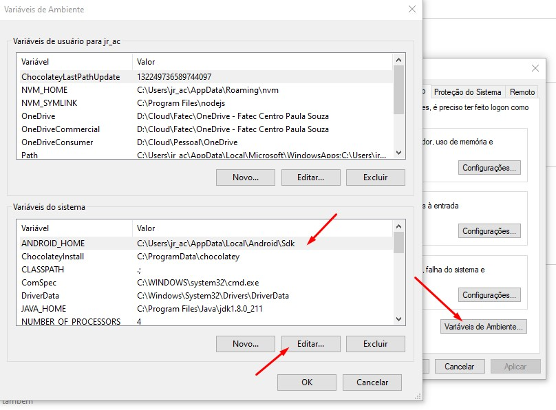
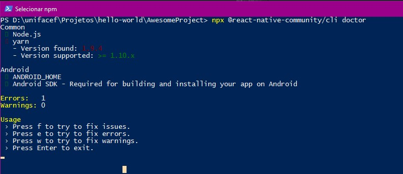

# Requisitos de Instalação


[Node.js (LTS)](https://nodejs.org/en/download/)
> Node is a JavaScript runtime built on Chrome's V8 JavaScript engine. 

ou 

[Node Version Mananger](https://github.com/coreybutler/nvm-windows/releases/download/1.1.7/nvm-setup.zip)
> Gerenciador de versões do Node

[Android Studio](https://developer.android.com/studio)
> Android IDE e  SDK

Ao instalar o android, selecione ao modo `custom`, selecionando o android device simulator.

[Chocolatey](https://chocolatey.org/) (Opcional)
> The Package Manager for Windows

Executar o seguinte comando no PowerShell (Como administrador)
```powershell
Set-ExecutionPolicy Bypass -Scope Process -Force; iex ((New-Object System.Net.WebClient).DownloadString('https://chocolatey.org/install.ps1'))
```

[Python2](https://www.python.org/ftp/python/2.7.2/python-2.7.2.amd64.msi)
> Linguagem de programação utilizada para compilar determinados scripts

[JDK8 Oracle](https://www.oracle.com/technetwork/pt/java/javase/downloads/jdk8-downloads-2133151.html)

[JDK8 Comunity](https://mega.nz/#F!EolCyShY!D0QUZdcafG1mUXbqWywFsg)
> Framework do Java

ou caso queira instalar com o Chocolatey
```
choco install -y python2 jdk8
```

# Variáveis de ambiente:

Incluir:

```
ANDROID_HOME=C:\Users\\<SEU_USUÁRIO>\AppData\Local\Android\Sdk
```



Adicionar no path:

```
c:\Users\\<SEU_USUÁRIO>\\AppData\Local\Android\Sdk\platform-tools
```

Execute esse script no seu Powershell para aceitar licenças do android SDK

```
 C:\Users\\<SEU_USUÁRIO>\AppData\Local\Android\Sdk\tools\bin\sdkmanager.bat --licenses
```

# Criando o primeiro projeto

Dentro da pasta 

```
C:\USERS\\<SEU_USUÁRIO>\
```

Criar uma nova pasta chamada projetos, e dentro dela executar o seguinte comando:

```
npx react-native init HelloProject
```

# Dicas e truques

```powershell
npx @react-native-community/cli doctor
```

> Rodar esse comando na pasta do projeto vai ajudar a verificar o que está faltando no seu ambiente

